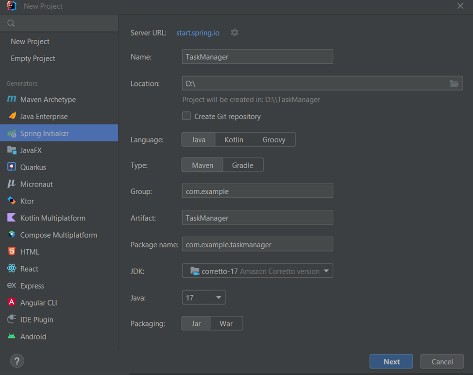
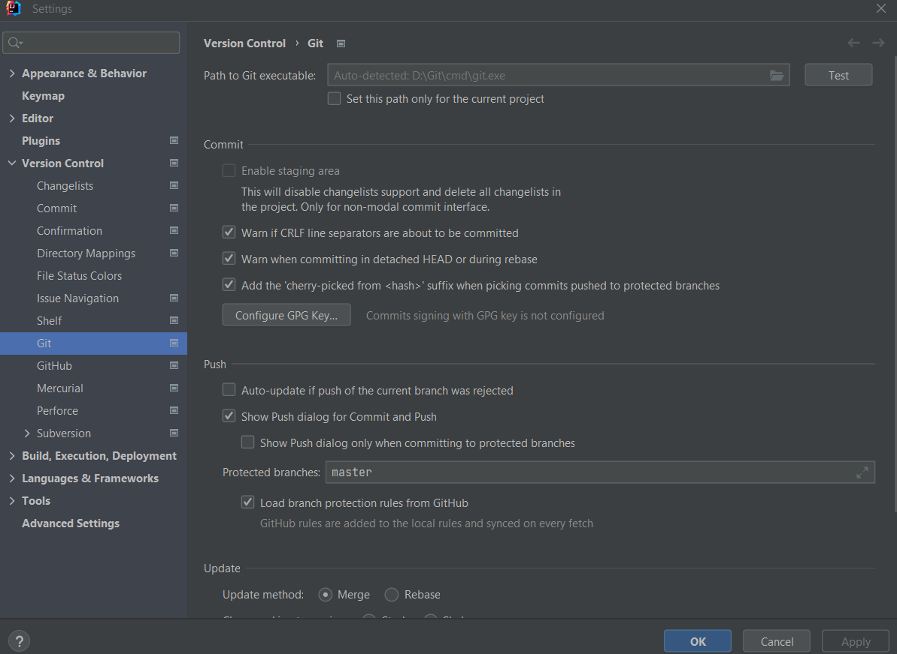

# TaskManager

### Backend server: 
* Java 17
* Необхідний JDK 17 версії. Це можна налаштувати в File -> Project Structure -> Project -> SDK

* Проєкт був створений та налаштований з допомогою Spring Initializr та обрані наступні налаштування


* В якості інструменту розробки обрано Maven. Якщо він не встановлений, на сайті [Maven for build](https://maven.apache.org/)
нас зустрічає докладна інструкція з завантаження та встановлення


* будемо використовувати Lombock, тому в pom-файлі має бути додана залежність
````  
      <dependency>
      <groupId>org.projectlombok</groupId>
      <artifactId>lombok</artifactId>
      <optional>true</optional>
      </dependency> 
   ````

* Також оскільки нам потрібно працювати з базою даних, підключаємо в pom залежність h2 database
````
      <dependency>
      <groupId>com.h2database</groupId>
      <artifactId>h2</artifactId>
      <scope>runtime</scope>
      </dependency>
````
* Для взаємодії з інформацією в реляційній БД підключено залежність 
````
     <dependency>
     <groupId>org.springframework.boot</groupId>
     <artifactId>spring-boot-starter-data-jpa</artifactId>
     </dependency>
   ````

* В проєкті планується аутентифікація користувачів. Безпеку додатку забезпечить фреймворк Spring Security. В pom-файлі відповідна залежність : 
````
      <dependency>
      <groupId>org.springframework.boot</groupId>
      <artifactId>spring-boot-starter-security</artifactId>
      </dependency>
````
* Підтримка валідації забезпечується залежністю 
````
      <dependency>
      <groupId>org.springframework.boot</groupId>
      <artifactId>spring-boot-starter-validation</artifactId>
      </dependency>
````
* За допомогою Spring Initializr зазначені залежності було додано автоматично, але також є можливість змінити налаштування  проєкту вручну в pom-файлі

### VCS
* Git можна встановити за посиланням  https://git-scm.com/download/win
* В середовищі розробки (в нашому випадку Intellij Idea) File->Settings->Version Control System -> Git 
має бути встановлений шлях до Git
* Натискаємо Import project from VCS та вставляємо посилання на репозиторій на github https://github.com/Alex-6346/TaskManager
